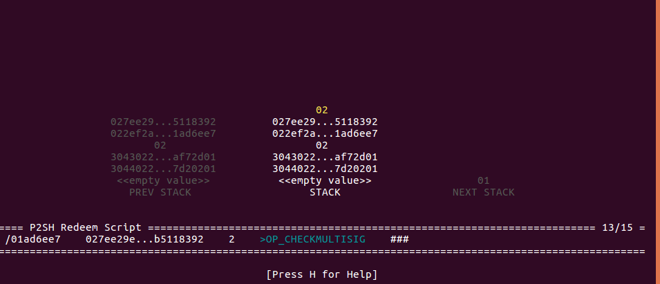

=====================================
The BitcoinScript Debugger
=====================================

BitcoinScript comes with an in-terminal ascii-graphical debugger.

The debugger lets you **navigate between script execution steps**, while displaying
the states of the **stack and tape**.

Screenshots
============

Starting the Debugger
======================

Programmatically
-------------------

Call `run_in_debugger()`.

The simplest example is loading a sample script along with its execution-args (flags and context),
and passing them on to `run_in_debugger()`::

    from bitcoinscript.debugger import run_in_debugger
    from bitcoinscript.samples import get_sample_exec_args
    a, kw = get_sample_exec_args('P2PKH')
    run_in_debugger(*a, **kw)
    

From interactive shell
----------------------------

Interactive shell's `Sdebug` command invokes the debugger with the scripts the interactive session is loaded with
(or the scripts interactively composed in it).

The simplest example is loading a sample script to the interactive shell, and then invoking the debugger::

    # load the sample script:
    Sloadsample P2SH P2MULTISIG
    # start the debugger:
    Sdebug

See `the docs <shell.html>`_ for more details about using the interactive shell.

Try it out from command line
-----------------------------

Simply run `debug_sample.py <https://github.com/fungibit/bitcoinscript/blob/master/bin/debug_sample.py>`_
script and specify a predefined sample script. For example::

    python3 bitcoinscript/bin/debug_sample.py P2PKH

Using the Debugger
======================

Once you start a debugger session, use the **arrow keys** to navigate forward and backward.

Press "Q" to quit.

Press "H" to see a HELP screen.

